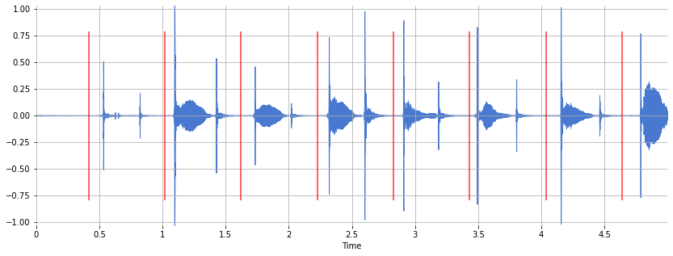
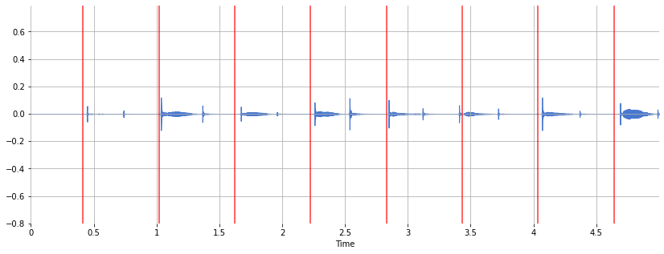

# cascade

Here lies the project named `cascade`. It was an attempt to use "real-time" web technology to bring musicians together in times of isolation. May it rest in peace, having failed nobly. This eulogy is an explanation and justification of the energy squandered toward an unfulfilled possibility.

If `cascade` had a tombstone in the digital cemetery, its inscription would read: "a testament to open source code and community-crafted protocols." Using [freely available code from the labor of many others](#credits), `cascade` was born as a video chat app - an uglier, fewer featured, and less compatible zoom clone - but with peer-to-peer streaming. That amount of technical sophistication with a week's worth of spare-time coding is incredible, and I am grateful to the giants on whose shoulders `cascade` stands, in addition to the great many enthusiastic non-giants, for sharing the fruits of their minds.

But tragically, being a video app was not enough - `cascade` had ambitions beyond mere chat. It attempted to navigate the treachery of internet latency to achieve musical coordination - and to do so with no special effort by the participants, using only technology already available in contemporary web browsers. This unwieldy ambition is the cause of its death - it failed to deliver on its promise. A proof of concept that proved to be no proof at all. It rests peacefully now in the great Github in the cloud.

## Table of contents

- [Why?](#why)
- [How?](#how)
- [Pontification on failure](#pontification-on-failure)
- [Pontification on possibility for resurrection from the grave](#pontification-on-possibility-for-resurrection-from-the-grave)
- [Technical details](#technical-details)
- [Credits](#credits)
- [TODOs that will never get done](#todos-that-will-never-get-done)

## Why?

Imagine this scenario: a group of musicians on lockdown, isolating themselves in their separate homes to control the spread of a nasty plague, wish they could still play music together.

There are free installable programs available that, using the [JACK API](https://en.wikipedia.org/wiki/JACK_Audio_Connection_Kit), claim low enough latencies to make in-person rhythmic timing possible - with the assumption that the musician has a fast & stable internet connection.

But how far can we get without assuming reliability, using technology built into the browser, without any installation? This is what `cascade` hoped to achieve - to allow group musical expression over unreliable connections.

## How?

Playing music over the internet with several peers requires each player to have a short latency for rhythmic accuracy. The key idea of `cascade` is to work around this by having the recording happen sequentially rather than simultaneously - each musician adds their performance over top of the previously recorded musicians. It takes the idea of the "zoom performance" popular during the pandemic, where musicians send around audio and video, layering piece by piece, and shrinks down the wait time to the shortest possible duration, to give the illusion of "real time."

<!---->

Here's how the app works from a human perspective: a group of musicians enter the `cascade` "green room" - a video chat room where everyone can see and hear everyone else.

<!---->

Before each game, the participants all agree on an order, choosing one person to lead the game. The leader, musician A, presses the button to begin, which closes the audio and video connection to the others.

<!---->

The leader starts playing music alone, unaccompanied. The audio and video streams are sent to musician B, who plays along.

<!---->

The combined audio and video from musicians A and B are sent to musician C, who plays along.

<!---->

And so forth, as the musical streams accumulate and cascade to each next person in the order. The last person is playing along with everyone else's streams.

When the leader, playing alone at the top of the cascade, has finished, they press the button to stop. The players all automatically send their video and audio to a server to be combined to give the illusion of the musicians playing at the same time, all together. The resulting digital artifact can be shared with friends and family over the internet as proof of existence.

For further information, see the [Technical Details section](#technical-details).

## Pontification on failure

Why did it fail? Firstly, it was not a pleasant musical experience. The way audio streaming is implemented in WebRTC, it will drop chunks of audio to make it closer to real-time, to minimize the latency - to avoid the awkward pause followed by accidental interruption. This means the beat can suddenly jump forward, while you're trying your best to follow. It can be frustrating and hard to retain musical concentration with the unexpected deviances. [Watch the clap test](./examples/clap_test.webm) and see how the receiver on the right gets off beat and has trouble getting back on. You can see the pain on her face 😖

Secondly, once such deviances are introduced into the recorded results, there needs to be a mechanism for coherent recombination of all the streams - an additional complication. One solution, used in this app, is to generate metronome audio, stream it from the musical leader along with the real-life audio-video, and record the metronome as it's received by each participant. In that way, although the received stream may have dropped chunks, the recorded audio can be stretched so that the metronomes match.

This is 10 seconds of audio of the receiving peer clapping along to the metronome. The detected beat onsets from the streamed metronome audio are shown by red vertical lines. The claps mostly align with the heard metronome.

This is the same audio with the metronome onsets from the first peer:

And this is the time-stretched audio aligned to the reference metronome:

This assumes that the additional metronome stream is subject to the same latency as the real audio stream, which may not be the case. That is to say, it seems possible that the real audio stream could drop a few milliseconds while the generated metronome stream did not.

The recombined time-stretched audio was not encouraging - as you can see above, it still retains the rhythmic mistimings from the shifting latency.

Additionally, although I didn't think of it until it was too late, there's nothing to stop one small chunk of audio with the metronome click from disappearing from the receiver's stream. This makes it very hard to align metronomes...

I do see a path forward - however, at this point, it's more effort than I care to give, considering the musical benefit is minimal. Over the course of the pandemic, it became apparent that meeting masked outdoors (in warm seasons, with plenty of distance) was a viable option for social music in real life, albeit with a small amount of risk. This is much preferable to clunky audio and a computer screen.

And so I feel that my time is better spent on other endeavors. But! If the prospects for this musical game excites you, read on for possibilities to revive the project that is dead (to me)...

## Pontification on possibility for resurrection from the grave

The basic premise of ignoring latency is not invalid - if we can assure a constant latency. A streaming protocol where the received stream has no dropped chunks or lags and will prioritize temporal continuity over both audio quality and absolute latency would be sufficient to implement this game properly. This is a tall order.

Alternatively, the JACK API could be used for low-latency recordings. But JACK is in C/C++. Therefore, a native GUI. What framework to use? How to make an installer that works for all OS? How to connect to the computer's webcam and stream video, since JACK only handles audio? Too many questions for a project that doesn't excite me anymore. Also, there are already free JACK apps available. Defeats the whole purpose of the keeping the project installation-free.

It does appear there are JACK/JackTrip implementations in JavaScript using WebRTC:

- [jacktrip-webrtc](https://github.com/jacktrip-webrtc/jacktrip-webrtc)
- [node-connector-jacktrip](https://github.com/unclechu/node-jack-connector)
- [simple-jack](https://github.com/mildsunrise/simplejack)

Most intriguing.

## Technical details

The user interface is a JavaScript React app. It connects to the computer's camera and microphone hardware using `getUserMedia()`. It streams the audio and video of peers to each other using the `simple-peer` interface to the browser's WebRTC API. RTC = "Real-Time Communication". It requires peers to share signals to initiate the streaming.

The server is the liaison between peers - it relays messages between them so that they can arrange to connect directly. The server uses `ws`, a node JS implementation of WebSockets. WebSockets allow continuous connection to all the peers, so the server can relay new signals as they arrive.

To change the cascade order, the first peer can drag the video tiles to the desired order. Dragging and dropping is implemented with the `react-dnd` library.

The React app also coordinates the details of the cascade connections, when the first peer presses the "GO" button. This is a good chunk of complicated code, but the details are not that interesting. You can dig into `client/src/state/actions/cascade.js` for more.

As the cascade begins, the first peer also generates a metronome pulse, using the Web Audio API `OscillatorNode` attached to a `GainNode` that turns on and off. The first peer cascades the metronome audio stream to the rest of the peers. All of the peers analyze the frequency content of the metronome audio using the Web Audio API `AnalyzerNode`. The metronome frequency signals when to start recording. When the last peer receives the metronome audio, it alerts the first peer that everyone is ready to go. The first peer then sends a blip in a higher frequency range - that is the signal to start recording with the browser's `MediaRecorder` API.

When the cascade is done, the React app coordinates resetting all streaming connections. It also sends the real audio/video and the metronome audio to the server.

The server analyzes the metronome audio from all participants to generate an `ffmpeg -filter_complex` command to align and timestretch each metronome beat audio chunk to match the first peer's reference metronome. To be precise: it slices the beat with `atrim`, aligns it to the reference metronome with `adelay`, stretches it to match length using `atempo`, and combines all the chunks with `amix` followed by `dynaudnorm` to normalize volume. It stacks the unmanipulated videos into a grid using the `xstack` command.

For more details on the metronome onset detection and a visual example of aligning audio, see the [Metronome Alignment notebook](./examples/metronome_alignment.ipynb).

For usage information, consult the [server readme](./server/readme.md) and the [client readme](./client/README.md).

## Credits

- [FFmpeg](https://ffmpeg.org/): timestretch audio, combine streams to one video output
- [`getUserMedia()`](https://developer.mozilla.org/en-US/docs/Web/API/MediaDevices/getUserMedia): capture audio & video from hardware devices in web browser
- [librosa](https://librosa.org/doc/latest/index.html): metronome onset detection in Python
- [`MediaRecorder`](https://developer.mozilla.org/en-US/docs/Web/API/MediaRecorder): record audio in web browser
- [React](https://reactjs.org/): front end framework for interactive JavaScript web browser applications
- [`react-dnd`](https://github.com/react-dnd/react-dnd): drag-n-drop the video tiles to change cascade order
- [`simple-peer`](https://github.com/feross/simple-peer): audio & video streaming; a simpler interface to the browser's implementation of WebRTC
- [Web Audio API](https://developer.mozilla.org/en-US/docs/Web/API/Web_Audio_API):
    - [`AnalyserNode`](https://developer.mozilla.org/en-US/docs/Web/API/AnalyserNode): spectral analysis for metronome onset detection
    - [`OscillatorNode`](https://developer.mozilla.org/en-US/docs/Web/API/OscillatorNode) and [`GainNode`](https://developer.mozilla.org/en-US/docs/Web/API/GainNode): metronome generation
- [`ws`](https://github.com/websockets/ws): WebSocket implementation for node server to relay peer-to-peer signals to set up the WebRTC connection

## TODOs that will never get done

- Issue: when the server is downloading the audio/video files from the clients, it cannot relay signals to restore the peer-to-peer video connections
- New Feature: download combined video from server
- New Feature: each participant can change the audio mix for performance
- New Feature: audio mix for final video
- New Feature: stream audio/video from client to server during performance
- New Feature: stream final video to youtube/facebook live/etc
- New Feature: record and stream whole set, including banter in "green room" in between cascades
- Productize: extend to multiple rooms (multiple groups using the server at once) and deploy the whole thing
